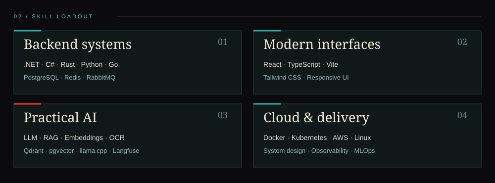

  <a href="https://www.rickyreza.site/"><strong>ENTER PORTFOLIO ↗</strong></a>
  &nbsp;&nbsp; / &nbsp;&nbsp;
  <a href="#01--operator-profile">PROFILE</a>
  &nbsp;&nbsp; / &nbsp;&nbsp;
  <a href="#02--skill-loadout">SKILL LOADOUT</a>
  &nbsp;&nbsp; / &nbsp;&nbsp;
  <a href="https://github.com/rickyreza12?tab=repositories">EXPLORE REPOSITORIES ↗</a>

### 01 / Operator profile

I'm Ricky, a **Senior Fullstack & AI Engineer** based in Jakarta, Indonesia.

I build maintainable backend systems, modern web applications, and practical AI-powered products. My interests sit at the intersection of **system design, distributed systems, and AI engineering**.

Currently exploring LLM inference, retrieval-augmented generation, embeddings, vector search, and the infrastructure that brings them into production.

### 02 / Skill loadout

View the stack as text

- **Backend:** .NET, C#, Rust, Python, Go
- **Data & messaging:** PostgreSQL, Redis, RabbitMQ
- **Frontend:** React, TypeScript, Vite, Tailwind CSS
- **AI & retrieval:** LLMs, RAG, embeddings, OCR, Qdrant, pgvector, llama.cpp, Langfuse
- **Cloud & delivery:** Docker, Kubernetes, AWS, Linux, observability, MLOps

### 03 / Engineering direction

**Build with purpose.** Reliable APIs, clear interfaces, and useful automation.

**Understand the system.** From inference and retrieval to data flow and deployment.

**Keep improving.** Explore, measure, and refine.

---

  <a href="https://www.rickyreza.site/"><strong>Explore the full interactive portfolio ↗</strong></a>
   
  RICKY REZA &nbsp; / &nbsp; BUILD · LEARN · REFINE

